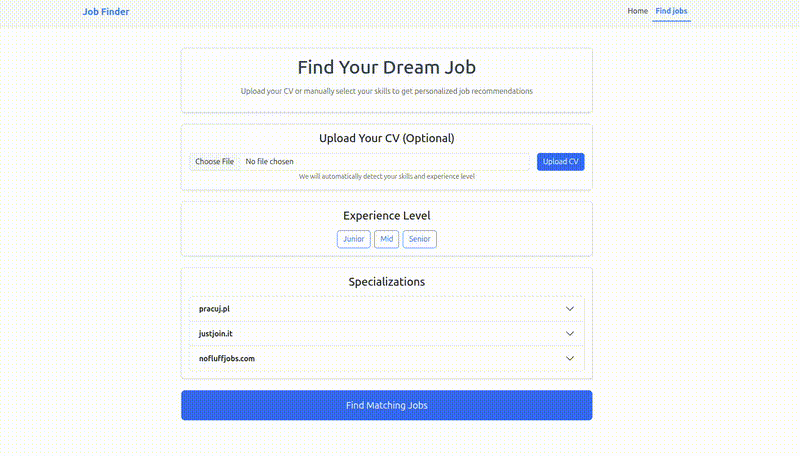

# Job Finder

A simple Django + React web app that scrapes personalized job listings from the major Polish job portals.

## Considerations

This app was created purely for educational purposes while respecting scraped websites' robots.txt files. Before using, please check out each site's terms of service.

## Features
- Scraping from 3 main Polish job sites  
- CV feature extraction with SentenceTransformer and keyword matching  
- Filtering by specialization & experience level  
- React frontend + Django REST backend  

## Technologies Used
- **Backend:** Django REST Framework  
- **Frontend:** React  
- **Scraping:** Selenium + BeautifulSoup  
- **NLP:** SentenceTransformers  
- **Database:** SQLite  

## Demo



## Cloning

```bash
git clone https://github.com/Infinity080/job-finder.git
cd job-finder
```

## Backend Setup

### 1. Install dependencies

```bash
python3 -m venv venv
source venv/bin/activate
pip install -r requirements.txt
```

### 2. Create .env in backend/job_finder_backend/ similar to this:
```bash
DJANGO_SECRET_KEY=your-secret-key
DEBUG=False
DJANGO_ALLOWED_HOSTS=localhost,127.0.0.1
FRONTEND_ORIGIN=http://localhost:3000
```

### 3. Run Backend
```bash
cd backend/job_finder_backend/
python manage.py migrate
python manage.py runserver
```

## Frontend Setup

### 1. Install dependencies
```bash
npm install
```

### 2. Run Frontend
```bash
npm start
```

## License

MIT License

